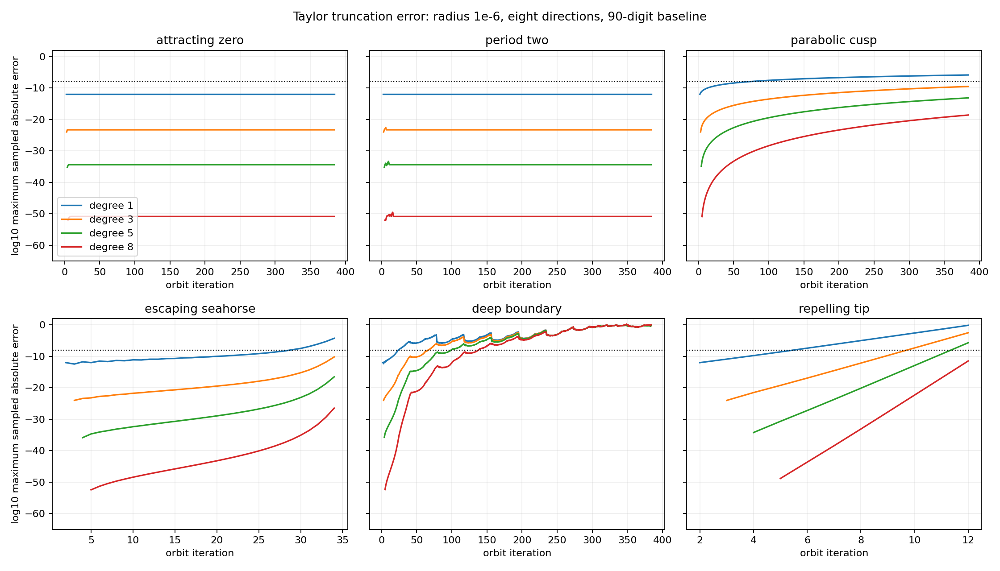
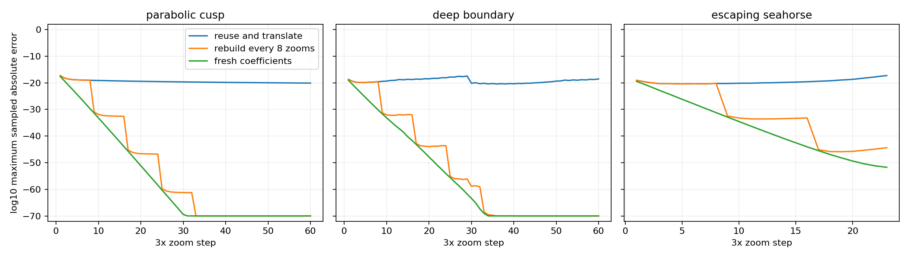
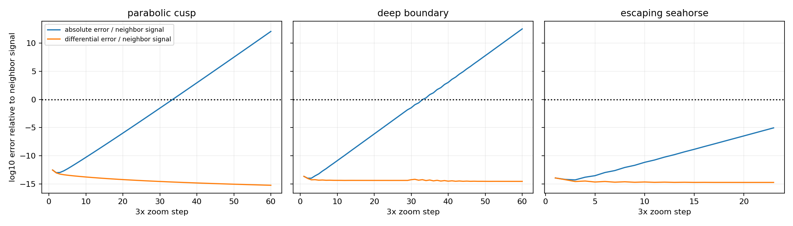
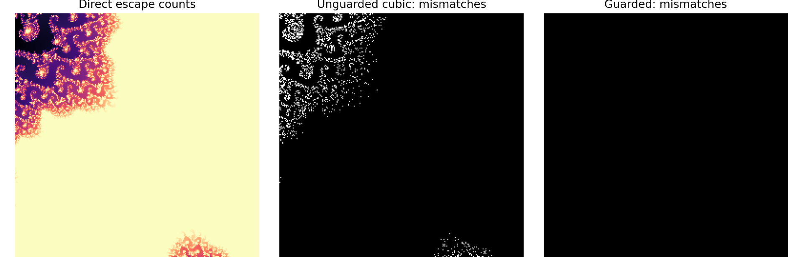

# Mandelbrot reuse: measured error growth and performance

The shortcut works, but its useful lifetime depends strongly on the orbit. In the tested regions, cubic error ranged from a stable floor to roughly 255× growth per additional iteration. Repeated zooming does not erase errors inherited from earlier approximations, yet much of that error can be shared by an entire patch: local differences remained remarkably accurate along the tested zoom paths. This suggests allowing drift in exact global location before resorting to deliberately generated new geometry.

The [original explainer](../mandelbrot-zoom-explainer.md) is preserved. The [proposed rendering plan](../constant-work-zoom-plan.md) uses these findings. The executable implementation is [experiments/run.py](../experiments/run.py); reproduction instructions are in the [README](../README.md).

**What was implemented and measured.**

The default run uses 90-digit Decimal complex arithmetic to compute reference orbits, Taylor coefficients, and directly iterated neighbor orbits. It measures degrees 1, 3, 5, and 8 at five radii: $10^{-3},10^{-6},10^{-9},10^{-12},10^{-18}$. Each radius is sampled in eight directions: the four axes and the four combinations of real part $\pm0.6$ and imaginary part $\pm0.8$.

| Label | Exact decimal parameter used | Reason to include it |
|---|---|---|
| Attracting zero | $0$ | Stable fixed-point behavior |
| Period two | $-1$ | Stable periodic behavior |
| Parabolic cusp | $0.25$ | Slow, marginal dynamics |
| Escaping seahorse | $-0.75+0.1i$ | An orbit that escapes after a substantial prefix |
| Deep boundary | $-0.743643887037151+0.13182590420533i$ | Complicated transient sensitivity |
| Repelling tip | $-2$ | A simple orbit with rapid, analytically tractable amplification |

“Deep boundary” names the chosen neighborhood; the finite decimal coordinate is not asserted to be an exact mathematical boundary point.

The sweep stops at 384 iterations or when the reference or any sampled neighbor exceeds magnitude 4. It records errors at every measured iteration, including bailout crossings, but treats prefix reuse as a separate question. There are 29,212 aggregate error records, each comparing eight neighbors, across 120 site/radius/degree combinations.

A precision audit repeats six site/radius combinations at 130 digits. For 4,503 recorded errors above the conservative numerical floor, the log-errors agree with the 90-digit run at the stored binary floating-point precision. Algebra checks independently verify the third-iterate polynomial and the exact derivative at $c=-2$. These checks support the reported measurements; they do not certify all unsampled points or turn floating-point bounds into interval proofs.

Additional experiments measure 60 successive 3× zooms with recentering, periodic coefficient rebuilding, low-precision perturbation, and five 256×256 rendering benchmarks. The rendering timings and escape-count comparisons use NumPy complex128 on this Mac, not high-precision per-pixel rendering or an iPhone GPU.

**Error growth has several regimes.**

The vertical axis is the base-10 logarithm of the maximum sampled absolute orbit error. The horizontal dotted line is $10^{-8}$. All panels use radius $10^{-6}$; their horizontal scales differ. Values below the conservative numerical floor are omitted. Abrupt termination of an exterior panel reflects the stopping rule, not a claim that errors stop growing.

At $c=0$, the cubic error settles near $5.000014\times10^{-24}$ and remains there through iteration 384. The neighboring attracting fixed point satisfies $z=z^2+d$, whose branch near zero is

$$
z(d)=\frac{1-\sqrt{1-4d}}{2}
=d+d^2+2d^3+5d^4+\cdots.
$$

The leading omitted cubic term is $5d^4$, explaining the measured plateau. More iterations do not necessarily increase approximation error. The period-two case also settles into bounded error of a similar scale, with a phase-dependent envelope.

At the cusp, the cubic error is approximately:

| Iteration | Maximum sampled error at radius $10^{-6}$ |
|---:|---:|
| 64 | $1.49\times10^{-15}$ |
| 128 | $1.57\times10^{-13}$ |
| 256 | $1.80\times10^{-11}$ |
| 384 | $2.96\times10^{-10}$ |

Between iterations 128 and 256, the observed growth is consistent with $n^{6.84}$ over that interval. This is a local empirical fit, not a universal exponent or an asymptotic proof. It contrasts with a constant exponential growth factor per iteration.

In the deep-boundary example, cubic error rises from $9.29\times10^{-14}$ at iteration 32 to $4.74\times10^{-9}$ at iteration 64. Over that interval, the geometric-average factor is about 1.40 per iteration, with substantial nonuniformity. At iteration 128 the error is $2.05\times10^{-6}$, and at 384 it is about 0.614. Higher degree postpones failure but does not keep a fixed-radius approximation accurate indefinitely in this experiment.

At the repelling tip, the cubic error rises from $7.15\times10^{-13}$ at iteration 8 to $4.64\times10^{-8}$ at iteration 10: approximately 255× per iteration over those two steps. This is truncation-error growth, which can be much faster than first-order orbit separation.

**Why one more iteration per 3× zoom can be too much.**

At $c=-2$, the reference orbit is $0,-2,2,2,\ldots$. Let $A_n=F_n'(c)$. Then

$$
A_1=1,\qquad A_2=-3,\qquad A_{n+1}=4A_n+1\quad(n\ge2),
$$

so

$$
A_n=-\frac{2\cdot4^{n-1}+1}{3}\quad(n\ge2).
$$

For small offsets, neighboring orbit differences scale like $A_nd$. If each zoom divides $d$ by 3 and adds one iteration, the leading separation eventually grows by about $4/3$ per zoom. The smaller pixel spacing does not compensate for the new dynamical amplification.

In a regime with approximately constant effective amplification $M>1$, maintaining comparable separation suggests

$$
\Delta n\lesssim\frac{\log 3}{\log M}
$$

additional iterations per 3× zoom. At the tip this is $\log_4 3\approx0.792$. This is a local scheduling heuristic; source terms, cancellation, higher-order terms, and changing orbit behavior prevent it from being a global rule.

The experiments also show about five extra cubic endpoint-accurate iterations for each 1,000× reduction in radius at the tip: the measured prefixes are 4, 9, 14, and 19 iterations at radii $10^{-3},10^{-6},10^{-9},10^{-12}$. That is consistent with $\log_4 1000\approx4.98$.

There is a separate bailout issue here: an outward neighbor of $-2$ already has magnitude greater than 2 at the first iteration. Consequently the whole-disk unescaped prefix is zero, even when an accurate endpoint polynomial exists. Endpoint accuracy does not preserve skipped escape times by itself.

**What polynomial degree buys.**

For the deep-boundary parameter at radius $10^{-6}$, use an absolute orbit-error budget of $10^{-8}$ and require an unescaped prefix:

| Degree | Prefix passing all eight sampled directions | Prefix accepted by the envelope |
|---:|---:|---:|
| 1 | 23 | 23 |
| 3 | 66 | 65 |
| 5 | 99 | 98 |
| 8 | 137 | 137 |

The envelope is the recurrence derived in the explainer, with scaled coefficients and a tail bound. In exact arithmetic it applies to the full parameter disk. Here it is computed with high-precision Decimal arithmetic, without outward rounding, so its experimental acceptance is not a machine-certified result.

At radius $10^{-3}$ the cubic sampled prefix is only 14. At $10^{-9}$ it reaches the full 384-iteration horizon. This illustrates the value of smaller tiles and deeper zoom. A result of 384 means “at least through the test horizon,” not a measured maximum or an infinite-validity claim.

At iteration 384 and radius $10^{-6}$, the conservative deep-boundary error envelope has already exceeded the implementation's large-value cutoff and is recorded as infinity, while the observed error remains finite. Losing complex cancellations can make the bound pessimistic. Increasing precision does not fix that kind of overestimation.

**Repeated reuse retains an old error floor.**

The recentering experiment starts with a cubic at iteration 10 and radius $10^{-5}$. Each step shifts the center by $r(0.12+0.08i)$, divides the radius by three, translates the polynomial, and advances one iteration. The new disk remains inside the old disk. Compare three policies: reuse forever, rebuild before every eighth zoom step, and rebuild at every new center and iteration.

The figure clips extremely small errors at $10^{-70}$ for readability; values close to the 90-digit arithmetic floor are not evidence of corresponding accuracy. A separate 130-digit rerun checks the differential-error measurement described below at all 143 repeated-zoom records.

For the deep-boundary path, after 60 zooms the radius is about $2.36\times10^{-34}$ and the iteration count is 70. The inherited cubic's absolute error is about $2.74\times10^{-19}$. However, the maximum sampled neighbor-to-center orbit difference is only $7.72\times10^{-32}$. The error is about **$3.55\times10^{12}$ times the signal we are trying to resolve**.

On both the cusp and deep-boundary paths, inherited absolute error first exceeds this neighbor signal at zoom step 34. That invalidates a simple independent absolute-error guarantee for local detail; it does not prove that the patch has lost its internal structure. Fresh coefficients and rebuilding every eight steps greatly reduce absolute error in the tested range. Their smallest reported errors eventually approach the finite-precision floor and should not be interpreted as certified digits.

Rebuilding is therefore useful, but it is not free: restarting at iteration $n$ requires work proportional to $n$ with this implementation, and deeper coordinates can require more precision. A hard frame budget must spread rebuilding over time or eventually change the approximation model.

The escaping-seahorse path terminates after 23 zoom steps when the next tested center orbit exceeds magnitude 4. This is an escaped path, not a failure to run the remaining requested steps.

**The useful surprise: local differences survive a much larger shared error.**

Subtract the center from each approximate and exact orbit before comparing them:

$$
E_{\mathrm{diff}}=\max_u
\left|[Q(u)-Q(0)]-[F_n(c+ru)-F_n(c)]\right|.
$$

Normalize by the maximum sampled true neighbor-to-center difference. This measures the local orbit shape separately from a shared offset in the whole patch.

After 60 zooms, the deep-boundary path's differential error is only $2.15\times10^{-46}$, or about **$2.78\times10^{-15}$ of the neighbor signal**. The cusp's corresponding ratio is $5.67\times10^{-16}$. Thus the same boundary patch whose absolute error exceeds the signal by trillions still preserves its sampled relative differences to roughly fourteen decimal digits. The separate 90-versus-130-digit audit checks all 143 differential-ratio records.

This is high-precision experimental evidence, not a claim of fourteen-digit accuracy using phone floats. It also measures local orbit geometry, not final escape-time or color accuracy. The full image stress tests below still show that later continuation can amplify small errors into visible classification changes.

The algebra explains why this can happen. Let the approximate reference differ by $e_0$, and let the approximate neighbor difference differ by $e_\Delta$. Ignoring new truncation and rounding for this single step,

$$
e_\Delta'=2(z+\Delta)e_\Delta+e_\Delta^2
+2e_0(\Delta+e_\Delta).
$$

The common reference error is multiplied by the small neighbor difference. It need not corrupt the local shape immediately. It can still grow during later iterations, and near critical behavior the situation can change. No claim is made that the resulting approximate patch shadows one exact nearby Mandelbrot parameter forever.

This gives a more promising first concession than immediately injecting synthetic geometry: let the exact global position drift while retaining a coherent local polynomial. Maintain separate estimates for shared orbit error and differential error. The former matters for faithful Mandelbrot classification; the latter is especially useful for judging a Mandelbrot-like visual continuation.

**Separating the reference from its offset preserves detail.**

The precision experiment computes a 90-digit reference orbit and compares direct complex64/complex128 iteration against perturbation in the same low-precision types. Recall that complex64 has two 32-bit real components, while complex128 has two 64-bit components.

At the deep-boundary parameter, iteration 128, and offset $d=10^{-30}(1+0.3i)$, adding the offset to the parameter collapses to the same value as the center in both low-precision types. Perturbation still preserves the offset's orbit effect. Its relative delta error is about $3.9\times10^{-7}$ in complex64 and $9.1\times10^{-16}$ in complex128 for this case.

These are errors in the small delta, not claims that the large reconstructed orbit value has that absolute accuracy. Perturbation still needs its reference calculation and can encounter cancellation or range problems. It addresses a precision bottleneck; skipping iterations addresses a separate work bottleneck.

**The easy speedups do not survive every detailed image.**

Each timing is the median of five runs after warmup. The image contains 65,536 pixels. “Raw jump” includes rebuilding the 90-digit cubic checkpoint for that frame, but does not include an error envelope or direct fallback. “Guarded” uses cached coefficients and a cached prefix envelope, propagates approximate float error envelopes, and recomputes risky pixels directly from iteration zero.

| Region and square half-width | Skip / iteration limit | Direct | Raw jump | Raw escape mismatches | Guarded |
|---|---:|---:|---:|---:|---:|
| Cusp, $10^{-6}$ | 128 / 256 | 70.8 ms | 37.4 ms | 0 | 115.6 ms |
| Deep boundary, $10^{-10}$ | 128 / 256 | 71.0 ms | 38.2 ms | 0 | 117.1 ms |
| Seahorse, $10^{-4}$ | 16 / 64 | 9.3 ms | 5.2 ms | 0 | 15.7 ms |
| Seahorse, $0.002$ | 8 / 256 | 53.3 ms | 51.3 ms | 116 / 65,536 | 139.1 ms |
| Deep boundary, $10^{-6}$ | 64 / 512 | 150.8 ms | 135.6 ms | 1,868 / 65,536 | 420.8 ms |

The first three grids are easy classification tests: all pixels share the same escape count or remain unresolved at the limit. Their approximately 1.78–1.89× raw speedups are useful arithmetic measurements but weak evidence about detailed boundary images.

The final two grids contain 228 and 257 distinct recorded escape-count values, including unresolved pixels. Their unguarded mismatch rates are 0.177% and 2.850%. Small initial approximation errors can still grow enough during continuation to change the escape count.

The left image displays direct escape counts for the detailed deep-boundary grid; pale unresolved pixels are not proven interior. The middle image marks incorrect raw-jump counts in white. The right image compares the guarded calculation and is black because its counts match the direct baseline on this grid.

The experimental guard falls back when its escape interval straddles radius 2 or its estimated orbit error exceeds $10^{-6}$. It adds a conservative floating-point padding term, but is not an interval-certified implementation. It falls back on about 91.2% of pixels in the wider seahorse case and 38.3% in the detailed boundary case. All five guarded grids match the direct double-precision escape counts.

The guarded implementation is slower in every case, even where no pixels fall back, because it performs many extra NumPy array operations and memory passes. This is evidence against this straightforward CPU implementation as a speed solution, not a benchmark of optimized fused GPU kernels, BLA, or mature fractal renderers. The raw-jump setup and guarded cached timings also have different setup inclusions, explicitly noted above.

**What these results justify building next.**

Use cubic reuse as a bounded-cost predictor and distinguish shared orbit error from uncertainty in newly visible local detail. Keep a fixed refinement allowance and bounded reference cache. Rebuild while the queue and precision budget permit it. First allow drift in exact global position while local structure remains reliable; introduce deterministic, temporally stable fractal detail only when that local model cannot keep up or becomes uninteresting.

That is a proposed Mandelbrot-like generative zoom, with a clear concession on exact fine geometry. Constant pixel count alone is insufficient; reference work, precision, fallback work, and history storage must also be bounded. The [implementation plan](../constant-work-zoom-plan.md) defines those budgets, a local detail-field construction, and visual tests for continuity and newly revealed structure.

No interactive generative viewer or iPhone implementation has been built in this experiment. No result here establishes exact arbitrary-depth Mandelbrot computation at constant cost. The measurements do establish useful shortcuts, expose their failure modes, and provide a reproducible basis for choosing the approximation policy.
